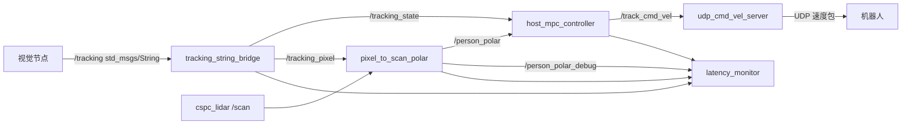

# host_udp_ws

`host_udp_ws` 是机器人主机端的人像跟随控制工作空间。主机接收视觉算法发布的 `/tracking`，结合激光雷达 `/scan` 得到目标距离和角度，通过 MPC 控制器计算 `/track_cmd_vel`，最后由 UDP 节点把速度指令发送给机器人。

本工作空间主要包含两个 ROS 2 package：

| Package | 作用 |
| --- | --- |
| `dog_udp_comm` | 人像跟随主流程、MPC 控制器、UDP 速度发送、延迟与调试工具。 |
| `cspc_lidar` | CSPC 激光雷达 ROS 2 SDK 封装，发布 `sensor_msgs/LaserScan` 到 `/scan`。 |

详细使用手册见：[docs/person_follow_usage.md](docs/person_follow_usage.md)。

## 系统流程



## 主要功能

- 根据视觉输出保持人像位于画面中心，目标位置为 `x = 0.5`。
- 使用实际图像尺寸 `640 x 384` 将归一化坐标转换为像素坐标。
- 根据人像像素位置投影到雷达角度，在 `/scan` 中做扇面搜索和稳定簇选择，估计目标距离。
- 使用 MPC 同时控制前进/后退速度和 Z 轴角速度。
- 当雷达短暂丢失但视觉仍检测到人像时，支持低速视觉跟随兜底。
- 当视觉丢失目标时，机器人原地等待。
- 内置安全机制：近距离保护、重新识别缓启动、雷达远距离跳变抑制、加速度限制、速度平滑。
- 内置延迟和调试日志：可查看视觉延迟、雷达帧年龄、相机/雷达同步差、控制命令年龄和采样控制帧。

## 环境要求

推荐运行环境：

- Ubuntu + ROS 2 Humble。
- 使用系统 Python，推荐 `/usr/bin/python3`。
- ROS 依赖：`rclcpp`、`rclpy`、`geometry_msgs`、`sensor_msgs`、`std_msgs`、`std_srvs`、`launch`、`launch_ros`。
- Python 依赖：`numpy`。

如果编译时 colcon 误用了虚拟环境，并出现 `ModuleNotFoundError: catkin_pkg`，请指定系统 Python：

```bash
cd ~/workspace/host_udp_ws
colcon build --symlink-install --cmake-args -DPython3_EXECUTABLE=/usr/bin/python3
```

## 编译

完整编译：

```bash
cd ~/workspace/host_udp_ws
colcon build --symlink-install --cmake-args -DPython3_EXECUTABLE=/usr/bin/python3
source install/setup.bash
```

只编译主控制包：

```bash
cd ~/workspace/host_udp_ws
colcon build --packages-select dog_udp_comm --symlink-install --cmake-args -DPython3_EXECUTABLE=/usr/bin/python3
source install/setup.bash
```

## 启动

启动完整人像跟随流程：

```bash
cd ~/workspace/host_udp_ws
source install/setup.bash
ros2 launch dog_udp_comm person_follow_udp_launch.py
```

也可以使用根目录脚本：

```bash
cd ~/workspace/host_udp_ws
./start_udp_command.sh
```

常用 launch 参数：

```bash
ros2 launch dog_udp_comm person_follow_udp_launch.py enable_lidar:=true enable_latency_monitor:=true
```

使用自定义参数文件：

```bash
ros2 launch dog_udp_comm person_follow_udp_launch.py follow_params_file:=/absolute/path/to/person_follow_params.yaml
```

如果 `/scan` 已经由其他程序发布，可以不启动雷达 launch：

```bash
ros2 launch dog_udp_comm person_follow_udp_launch.py enable_lidar:=false
```

如果不需要延迟监控：

```bash
ros2 launch dog_udp_comm person_follow_udp_launch.py enable_latency_monitor:=false
```

## 视觉输入格式

视觉节点需要发布 `std_msgs/msg/String` 到 `/tracking`。

数据格式：

```text
x y detected timestamp
```

示例：

```bash
ros2 topic pub /tracking std_msgs/msg/String "{data: '0.57 0.27 1.0 1780645417898.0'}"
```

字段含义：

| 字段 | 含义 |
| --- | --- |
| `x` | 目标中心点 x 归一化坐标，范围 `[0, 1]`，画面中心为 `0.5`。 |
| `y` | 目标中心点 y 归一化坐标，范围 `[0, 1]`。 |
| `detected` | `1.0` 表示检测到目标，`-1.0` 表示目标丢失。 |
| `timestamp` | 视觉源时间戳。可以是秒、毫秒、微秒或纳秒，bridge 会自动归一化。 |

当前图像尺寸在 YAML 中配置为：

```yaml
image_width: 640.0
image_height: 384.0
```

## 主要话题

| 话题 | 类型 | 发布者 | 订阅者 | 作用 |
| --- | --- | --- | --- | --- |
| `/tracking` | `std_msgs/String` | 视觉节点 | `tracking_string_bridge` | 原始视觉目标输出。 |
| `/tracking_state` | `geometry_msgs/Vector3Stamped` | `tracking_string_bridge` | 控制器、延迟监控 | 结构化目标状态。 |
| `/tracking_pixel` | `geometry_msgs/PointStamped` | `tracking_string_bridge` | `pixel_to_scan_polar` | 用于雷达匹配的像素坐标。 |
| `/scan` | `sensor_msgs/LaserScan` | `cspc_lidar` | `pixel_to_scan_polar` | 激光雷达扫描数据。 |
| `/person_polar` | `geometry_msgs/Vector3Stamped` | `pixel_to_scan_polar` | 控制器、延迟监控 | 目标距离和角度。 |
| `/person_polar_debug` | `std_msgs/String` | `pixel_to_scan_polar` | 延迟监控 | 雷达匹配调试信息。 |
| `/track_cmd_vel` | `geometry_msgs/Twist` | `host_mpc_controller` | `udp_cmd_vel_server` | 发送给机器人的速度指令。 |

`/person_polar` 字段说明：

| 字段 | 含义 |
| --- | --- |
| `vector.x` | 滤波后的目标距离，单位 m。 |
| `vector.y` | 控制器使用的目标角度，单位 rad。 |
| `vector.z` | 相机/雷达时间戳差，单位 s，仅用于诊断。 |

## 调试和延迟日志

当 `enable_latency_monitor: true` 时，系统每秒打印一次 summary，并将日志写入：

```bash
~/.ros/person_follow_logs/
```

查看最新日志：

```bash
ls -lt ~/.ros/person_follow_logs/
```

实时查看最新日志：

```bash
tail -f "$(ls -t ~/.ros/person_follow_logs/person_follow_debug_*.log | head -1)"
```

关键字段：

| 字段 | 含义 |
| --- | --- |
| `tracking=...Hz` | 视觉 `/tracking` 频率。 |
| `person=...Hz` | 雷达融合后的 `/person_polar` 频率。雷达匹配正常时应接近视觉频率。 |
| `cmd=...Hz` | `/track_cmd_vel` 频率，通常等于 `control_hz`。 |
| `tracking_source_age_p50` | 视觉源时间戳延迟。当前视觉约 `80-120 ms` 属于正常范围。 |
| `scan_age_p50` | 融合时使用的雷达帧年龄，越低越好。 |
| `sync_diff_p50` | 视觉时间戳与雷达时间戳差。使用 `scan_select_policy: latest` 时该值可能偏大，因为系统优先使用更新鲜的雷达帧。 |
| `cmd_age` | 从最近一次 tracking/person 消息到控制命令发布的年龄。 |
| `lidar_stats` | 雷达命中率、原始距离抖动、滤波后距离抖动等。 |
| `cmd_frame` | 采样控制帧，包含 `vx`、`wz` 和消息年龄。 |

控制帧示例：

```text
cmd_frame t=2026-06-09T15:30:12.345 seq=126 vx=+0.0680 wz=-1.1180 from_state_age=116.1ms from_person_age=129.9ms
```

## 常用检查命令

查看话题频率：

```bash
ros2 topic hz /tracking
ros2 topic hz /tracking_state
ros2 topic hz /person_polar
ros2 topic hz /track_cmd_vel
ros2 topic hz /scan
```

查看话题内容：

```bash
ros2 topic echo /tracking
ros2 topic echo /person_polar
ros2 topic echo /track_cmd_vel
```

发布模拟 tracking 数据：

```bash
ros2 topic pub /tracking std_msgs/msg/String "{data: '0.3 0.3 1.0 1780645417898.0'}" -r 15
```

手动初始化 UDP 接收端：

```bash
ros2 service call /init_udp_receiver std_srvs/srv/Trigger {}
```

## 常见问题

### 编译报错：`ModuleNotFoundError: No module named 'catkin_pkg'`

通常是 colcon 使用了虚拟环境 Python，而不是系统 Python。

解决方法：

```bash
cd ~/workspace/host_udp_ws
colcon build --symlink-install --cmake-args -DPython3_EXECUTABLE=/usr/bin/python3
```

### 编译报错：重复 package 名称

如果 colcon 提示重复的 `cspc_lidar`，说明 `src/` 下有两个同名 ROS package。保留一个，或者在不需要的目录中添加 `COLCON_IGNORE`。

### UDP 日志显示 `receivers=0`

说明控制命令已经生成，但 UDP 没有有效接收端。

检查方向：

- 确认机器人端 heartbeat 能到达主机 `8888` 端口。
- 或在 YAML 中设置 `use_fixed_receiver: true`，并配置正确的 `remote_ip` 和 `remote_port`。
- 检查防火墙和网卡 IP。

### 机器人转向方向反了

当前硬件和相机安装方向需要：

```yaml
reverse_angular_output: true
```

除非硬件安装或机器人角速度约定改变，否则保持该参数为 `true`。

### 有 tracking 但机器人不前进

先检查：

```bash
ros2 topic hz /person_polar
ros2 topic echo /person_polar
```

再看日志：

```bash
grep -E "lidar_match|lidar_stats|cmd_frame|cmd_age" ~/.ros/person_follow_logs/person_follow_debug_*.log | tail -100
```

常见原因：

- 雷达没有匹配到有效目标距离。
- 目标已经在安全距离以内，控制器禁止前进。
- 视觉输出 `detected=-1` 或 tracking 超时。
- `force_zero_linear_velocity` 被设置为 `true`。

## 开发说明

运行工具函数测试：

```bash
cd ~/workspace/host_udp_ws
python3 -B src/dog_udp_comm/test/test_person_follow_utils.py
```

修改代码后重新编译：

```bash
cd ~/workspace/host_udp_ws
colcon build --packages-select dog_udp_comm --symlink-install --cmake-args -DPython3_EXECUTABLE=/usr/bin/python3
source install/setup.bash
```
